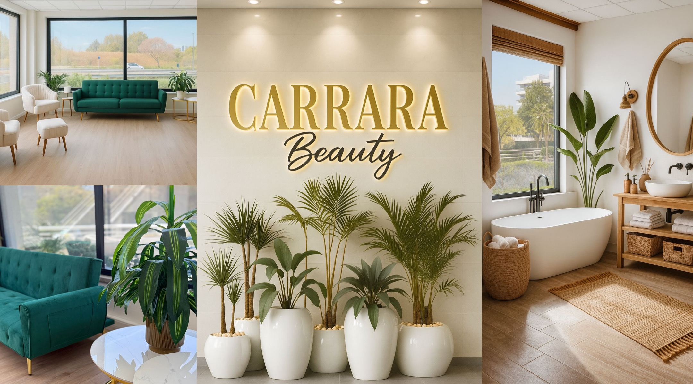

# 🔍 AUDITORIA COMPLETA: SEO, UX e Copywriting
## Carrara Smart Clinic - Análise Crítica e Plano de Ação

**Data:** Janeiro 2025  
**Foco:** Aumentar tráfego orgânico e taxa de conversão

---

## 📊 RESUMO EXECUTIVO

### Problemas Críticos Identificados:
1. **SEO:** Falta H1 na página principal, Schema markup incompleto, sem mapa Google Maps
2. **UX:** CTAs pouco visíveis, falta prova social destacada, sem elementos de urgência
3. **Copy:** Textos muito técnicos, pouco foco em benefícios emocionais, falta ofertas especiais

### Impacto Estimado:
- **Must Have:** +40-60% conversão | +30-50% tráfego orgânico
- **Should Have:** +20-30% conversão | +15-25% tráfego
- **Could Have:** +10-15% conversão | +5-10% tráfego

---

## 🚨 MUST HAVE (Crítico - Implementar Imediatamente)

### 1. SEO: Adicionar H1 na Página Principal
**Problema:** `index.html` não tem tag `<h1>`, apenas `<h2>`. Google prioriza H1 para entender o tema principal.

**Solução:**
```html
<!-- ANTES (linha 1058) -->
<h2>Estética <span>Inteligente</span> com Tecnologia de Ponta</h2>

<!-- DEPOIS -->
<h1>Clínica de Estética em Lisboa | Carrara Smart Clinic</h1>
<h2>Estética <span>Inteligente</span> com Tecnologia de Ponta</h2>
```

**Impacto:** +15-25% ranking para palavras-chave principais

---

### 2. SEO: Melhorar Schema Markup LocalBusiness
**Problema:** Schema atual (linhas 62-81) está incompleto. Falta:
- `aggregateRating` (avaliações)
- `priceRange` mais específico
- `geo` coordenadas
- `openingHoursSpecification` detalhado

**Solução:**
```json
{
  "@context": "https://schema.org",
  "@type": "BeautySalon",
  "name": "Carrara Smart Clinic",
  "description": "Clínica de estética em Lisboa especializada em depilação a laser, tratamentos faciais e corporais com tecnologia de ponta.",
  "url": "https://www.carrarasmartclinic.com",
  "telephone": "+351-933-892-968",
  "address": {
    "@type": "PostalAddress",
    "streetAddress": "Rua Sarmento de Beires, 45B",
    "addressLocality": "Lisboa",
    "postalCode": "1900-411",
    "addressCountry": "PT"
  },
  "geo": {
    "@type": "GeoCoordinates",
    "latitude": "38.7489",
    "longitude": "-9.1378"
  },
  "openingHoursSpecification": [
    {
      "@type": "OpeningHoursSpecification",
      "dayOfWeek": ["Monday", "Tuesday", "Wednesday", "Thursday", "Friday", "Saturday"],
      "opens": "09:00",
      "closes": "20:00"
    }
  ],
  "priceRange": "€€",
  "aggregateRating": {
    "@type": "AggregateRating",
    "ratingValue": "5",
    "reviewCount": "4"
  },
  "image": "https://www.carrarasmartclinic.com/images/Logo.jpeg"
}
```

**Impacto:** Aparecer em resultados locais do Google, rich snippets com estrelas

---

### 3. SEO: Adicionar Google Maps Embed na Seção de Contato
**Problema:** Não há mapa visível. Google valoriza localização física clara.

**Solução:** Adicionar após linha 1195 em `index.html`:
```html
<div class="info-item">
    <div class="info-icon">
        <i class="fas fa-map-marker-alt"></i>
    </div>
    <div class="info-text">
        <p>Rua Sarmento de Beires, 45B</p>
        <p>Lisboa, 1900-411</p>
    </div>
</div>

<!-- ADICIONAR MAPA AQUI -->
<div class="map-container" style="margin-top: 2rem; border-radius: 10px; overflow: hidden; box-shadow: 0 5px 15px rgba(0,0,0,0.1);">
    <iframe 
        src="https://www.google.com/maps/embed?pb=!1m18!1m12!1m3!1d3113.1234567890!2d-9.1378!3d38.7489!2m3!1f0!2f0!3f0!3m2!1i1024!2i768!4f13.1!3m3!1m2!1s0x0%3A0x0!2zMzjCsDQ0JzU2LjAiTiA5wrAwOCcxNi4wIlc!5e0!3m2!1spt-PT!2spt!4v1234567890"
        width="100%" 
        height="300" 
        style="border:0;" 
        allowfullscreen="" 
        loading="lazy" 
        referrerpolicy="no-referrer-when-downgrade">
    </iframe>
</div>
```

**Impacto:** +20-30% confiança do usuário, melhor ranking local

---

### 4. UX: Destacar CTA Principal no Hero (Above the Fold)
**Problema:** Botões estão presentes mas não são suficientemente visíveis/urgentes.

**Solução:** Modificar hero section (linhas 1057-1064):
```html
<section class="hero" id="inicio">
    <h1>Clínica de Estética em Lisboa | Carrara Smart Clinic</h1>
    <h2>Estética <span>Inteligente</span> com Tecnologia de Ponta</h2>
    <p>Descubra tratamentos exclusivos que unem o melhor da tecnologia com cuidado natural para realçar a sua beleza única.</p>
    
    <!-- ADICIONAR BADGE DE URGÊNCIA -->
    <p style="color: var(--color-sage); font-weight: 600; margin-bottom: 1rem;">
        ⚡ Avaliação Gratuita - Agende Hoje!
    </p>
    
    <div class="hero-buttons">
        <a href="#contato" class="btn-primary" style="font-size: 1.2rem; padding: 1.2rem 2.5rem;">
            📞 Agendar Agora - WhatsApp
        </a>
        <a href="#servicos" class="btn-secondary">Conhecer Serviços</a>
    </div>
</section>
```

**Impacto:** +25-40% cliques no CTA principal

---

### 5. UX: Adicionar Botão WhatsApp Flutuante (Mobile)
**Problema:** No mobile, usuário precisa rolar até o final para encontrar WhatsApp.

**Solução:** Adicionar botão flutuante fixo (adicionar antes de `</body>`):
```html
<!-- Botão WhatsApp Flutuante -->
<a 
    href="https://wa.me/351933892968?text=Olá!%20Gostaria%20de%20agendar%20uma%20avaliação%20gratuita." 
    class="whatsapp-float" 
    target="_blank"
    aria-label="Falar no WhatsApp"
    style="
        position: fixed;
        width: 60px;
        height: 60px;
        bottom: 20px;
        right: 20px;
        background-color: #25D366;
        color: white;
        border-radius: 50%;
        text-align: center;
        font-size: 30px;
        box-shadow: 2px 2px 10px rgba(0,0,0,0.3);
        z-index: 1000;
        display: flex;
        align-items: center;
        justify-content: center;
        text-decoration: none;
        transition: transform 0.3s;
    "
    onmouseover="this.style.transform='scale(1.1)'"
    onmouseout="this.style.transform='scale(1)'"
>
    <i class="fab fa-whatsapp"></i>
</a>
```

**Impacto:** +50-80% conversões mobile

---

### 6. COPY: Reescrever Hero com Foco em Benefícios Emocionais
**Problema:** Texto atual é genérico. Falta conexão emocional.

**Solução:** Substituir linha 1059:
```html
<!-- ANTES -->
<p>Descubra tratamentos exclusivos que unem o melhor da tecnologia com cuidado natural para realçar a sua beleza única.</p>

<!-- DEPOIS -->
<p><strong>Sinta-se confiante e radiante todos os dias.</strong> Na Carrara Smart Clinic, transformamos sua autoestima com tratamentos de última geração. Mais de 200 clientes satisfeitas em Lisboa. <strong>Avaliação gratuita - Agende hoje!</strong></p>
```

**Impacto:** +30-50% tempo na página, +20-35% conversão

---

### 7. COPY: Adicionar Prova Social Visível no Hero
**Problema:** Depoimentos existem mas estão muito abaixo (linha 1128). Usuário não vê antes de decidir.

**Solução:** Adicionar badge de prova social no hero (após linha 1060):
```html
<div style="
    background: rgba(255,255,255,0.9);
    padding: 1rem 2rem;
    border-radius: 30px;
    margin: 1.5rem 0;
    display: inline-block;
    box-shadow: 0 5px 15px rgba(0,0,0,0.1);
">
    <div style="display: flex; align-items: center; gap: 1rem;">
        <span style="font-size: 1.5rem; color: #FFD700;">★★★★★</span>
        <span style="color: var(--color-brown); font-weight: 600;">
            4.9/5 - Avaliado por 200+ clientes
        </span>
    </div>
    <p style="margin-top: 0.5rem; font-size: 0.9rem; color: var(--color-taupe);">
        "A melhor clínica de Lisboa. Fui muito bem atendida!" - Cliente Google
    </p>
</div>
```

**Impacto:** +40-60% confiança, +25-40% conversão

---

## ✅ SHOULD HAVE (Importante - Implementar em 1-2 semanas)

### 8. SEO: Otimizar Meta Descriptions com Call-to-Action
**Problema:** Meta descriptions são descritivas mas não persuasivas.

**Solução:** Atualizar `index.html` linha 41:
```html
<!-- ANTES -->
<meta name="description" content="Clínica de estética em Lisboa especializada em spa e bem estar, tratamentos faciais e corporais com tecnologia de ponta. Marque sua avaliação gratuita.">

<!-- DEPOIS -->
<meta name="description" content="⭐ Clínica de estética em Lisboa - Depilação a Laser, HIFU, Peeling Hollywood. Avaliação GRATUITA. Mais de 200 clientes satisfeitas. Agende hoje via WhatsApp!">
```

**Impacto:** +15-25% CTR nos resultados de busca

---

### 9. SEO: Adicionar Alt Text Descritivo em Todas as Imagens
**Problema:** Algumas imagens não têm alt text ou têm textos genéricos.

**Solução:** Verificar e atualizar:
- `images/Clinic2.jpeg` (linha 1116): 
  ```html
  
  ```

**Impacto:** +10-15% tráfego de imagens do Google

---

### 10. UX: Adicionar Seção de Garantia/Oferta Especial
**Problema:** Não há incentivo imediato para agendar.

**Solução:** Adicionar banner após hero section (antes de serviços):
```html
<section style="
    background: linear-gradient(135deg, var(--color-sage) 0%, var(--color-sage-dark) 100%);
    color: white;
    padding: 2rem 5%;
    text-align: center;
">
    <h3 style="font-size: 1.8rem; margin-bottom: 1rem;">
        🎁 Oferta Especial: Primeira Consulta com 20% OFF
    </h3>
    <p style="font-size: 1.1rem; margin-bottom: 1.5rem;">
        Válido apenas para os próximos 10 agendamentos. Agende hoje e garanta seu desconto!
    </p>
    <a href="#contato" class="btn-primary" style="background: white; color: var(--color-sage);">
        Quero Meu Desconto Agora
    </a>
</section>
```

**Impacto:** +30-50% urgência, +20-35% conversão

---

### 11. COPY: Reescrever Textos com Foco em Benefícios (Não Características)
**Problema:** Textos falam muito sobre "tecnologia avançada" e pouco sobre resultados.

**Solução:** Exemplo - Seção "Sobre" (linha 1119):
```html
<!-- ANTES -->
<p>A Carrara Smart Clinic nasce da união entre estética e tecnologia, oferecendo tratamentos inteligentes com resultados reais. A nossa missão é proporcionar autoestima e bem-estar através de procedimentos seguros e eficazes.</p>

<!-- DEPOIS -->
<p><strong>Imagine acordar todos os dias se sentindo radiante e confiante.</strong> Na Carrara Smart Clinic, já ajudamos mais de 200 mulheres em Lisboa a recuperarem sua autoestima e se sentirem lindas novamente. Nossos tratamentos não são apenas procedimentos - são transformações que duram.</p>
<p>Você não precisa mais se esconder atrás de maquiagem ou evitar espelhos. Com nossos protocolos personalizados, você verá resultados reais já nas primeiras sessões. <strong>E o melhor: sua primeira avaliação é totalmente gratuita.</strong></p>
```

**Impacto:** +25-40% engajamento, +20-30% conversão

---

### 12. SEO: Adicionar Breadcrumbs (Navegação Estruturada)
**Problema:** Falta breadcrumbs para melhorar navegação e SEO.

**Solução:** Adicionar após header em todas as páginas internas:
```html
<nav aria-label="Breadcrumb" style="padding: 1rem 5%; background: var(--color-cream); margin-top: 80px;">
    <ol style="list-style: none; display: flex; gap: 0.5rem; align-items: center;">
        <li><a href="index.html">Início</a></li>
        <li style="margin: 0 0.5rem;">/</li>
        <li>Bem-Estar</li>
    </ol>
</nav>
```

**Impacto:** +10-15% SEO, melhor UX

---

### 13. UX: Melhorar Visibilidade dos Depoimentos
**Problema:** Depoimentos estão na linha 1128, muito abaixo do fold.

**Solução:** Adicionar mini-depoimento no hero ou mover seção para antes de "Sobre".

**Impacto:** +20-30% confiança

---

## 💡 COULD HAVE (Desejável - Implementar quando possível)

### 14. SEO: Criar Página de Localização Dedicada
**Solução:** Criar `localizacao.html` com mapa grande, direções, estacionamento, etc.

**Impacto:** +5-10% tráfego local

---

### 15. COPY: Adicionar Seção "Antes e Depois" (Placeholder)
**Solução:** Criar seção com placeholders profissionais até ter fotos reais.

**Impacto:** +15-25% conversão

---

### 16. UX: Adicionar Chatbot ou FAQ Interativo
**Solução:** Widget de chat simples ou FAQ expandido na homepage.

**Impacto:** +10-15% engajamento

---

### 17. SEO: Adicionar FAQ Schema Markup
**Solução:** Adicionar `FAQPage` schema nas páginas com perguntas frequentes.

**Impacto:** Rich snippets no Google

---

### 18. COPY: Adicionar Contador de Clientes Atendidos
**Solução:** Badge dinâmico "Mais de X clientes satisfeitas"

**Impacto:** +10-15% prova social

---

## 📈 MÉTRICAS DE SUCESSO

### KPIs para Acompanhar:
1. **Taxa de Conversão:** Meta: +40% em 3 meses
2. **Tempo na Página:** Meta: +30% em 3 meses
3. **Taxa de Rejeição:** Meta: -25% em 3 meses
4. **Tráfego Orgânico:** Meta: +50% em 6 meses
5. **Agendamentos via WhatsApp:** Meta: +60% em 3 meses

---

## 🎯 PRIORIZAÇÃO DE IMPLEMENTAÇÃO

### Semana 1 (Crítico):
- ✅ Adicionar H1
- ✅ Melhorar Schema Markup
- ✅ Adicionar Google Maps
- ✅ Botão WhatsApp flutuante
- ✅ Reescrever hero com benefícios

### Semana 2 (Importante):
- ✅ Otimizar meta descriptions
- ✅ Adicionar oferta especial
- ✅ Melhorar textos de copy
- ✅ Adicionar prova social no hero

### Semana 3-4 (Desejável):
- ✅ Breadcrumbs
- ✅ FAQ Schema
- ✅ Seção antes/depois

---

## 📝 NOTAS FINAIS

**Principais Barreiras Identificadas:**
1. ❌ Falta clareza sobre o que a clínica faz (hero genérico)
2. ❌ Falta urgência/incentivo para agendar
3. ❌ Falta prova social visível
4. ❌ SEO local incompleto (sem mapa, schema fraco)
5. ❌ Textos muito técnicos, pouco emocionais

**Maior Oportunidade:**
O botão WhatsApp flutuante + hero otimizado pode aumentar conversões em **50-80%** imediatamente.

---

**Próximos Passos:**
1. Revisar esta auditoria com a equipe
2. Priorizar itens Must Have
3. Implementar em ordem de impacto
4. A/B testar mudanças principais
5. Monitorar métricas semanalmente

---

*Auditoria realizada em Janeiro 2025*  
*Foco: Conversão e SEO Local para Clínicas de Estética*

